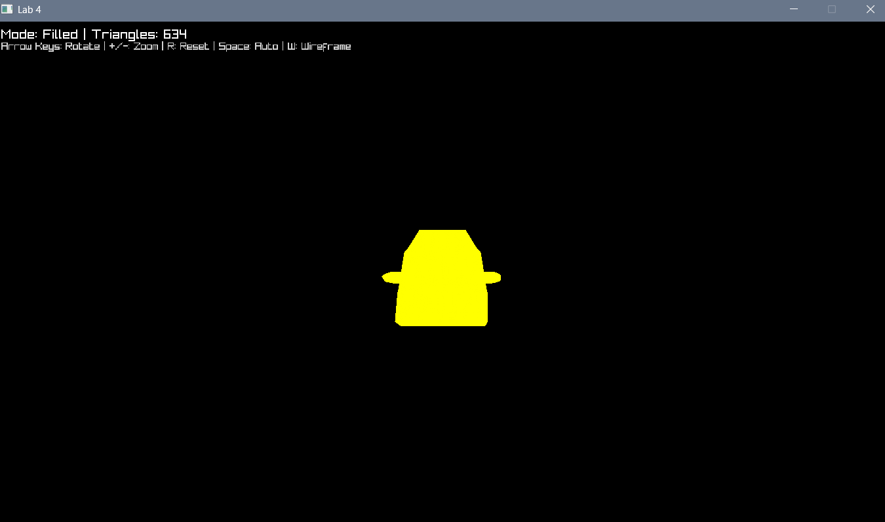

<<<<<<< HEAD
# Lab 4: Carga de Modelos 3D

## Descripción
Este proyecto es un renderizador 3D desarrollado en Rust que carga y visualiza modelos en formato OBJ. Implementa un pipeline de renderizado completo con transformaciones 3D, rasterización manual de triángulos y un sistema de cámara interactivo.

## Estructura del Proyecto

```
src/
├── main.rs          # Bucle principal de la aplicación y gestión de ventana
├── obj.rs           # Cargador y parser de archivos OBJ
├── framebuffer.rs   # Implementación del framebuffer con depth buffer
├── triangle.rs      # Rasterización manual de triángulos
├── camera.rs        # Sistema de cámara 3D con transformaciones MVP
assets/
└── Spaceship.obj    # Modelo 3D de una nave espacial
```

## Controles

| Tecla | Acción |
|-------|--------|
| **Teclas Direccionales** | Rotar el modelo |
| **+/-** | Acercar/Alejar la cámara |
| **R** | Resetear posición de la cámara |
| **Espacio** | Alternar rotación automática |
| **W** | Cambiar entre modo wireframe y relleno |
| **ESC** | Salir de la aplicación |

## Captura de Pantalla



## Requisitos

- Rust 2021+
- raylib (gestión de ventanas e input)
- nalgebra (matemáticas 3D y transformaciones)

## Ejecución

```bash
cargo run
```
=======
# GraficasAndSpace
>>>>>>> parent of f788439 (change)
