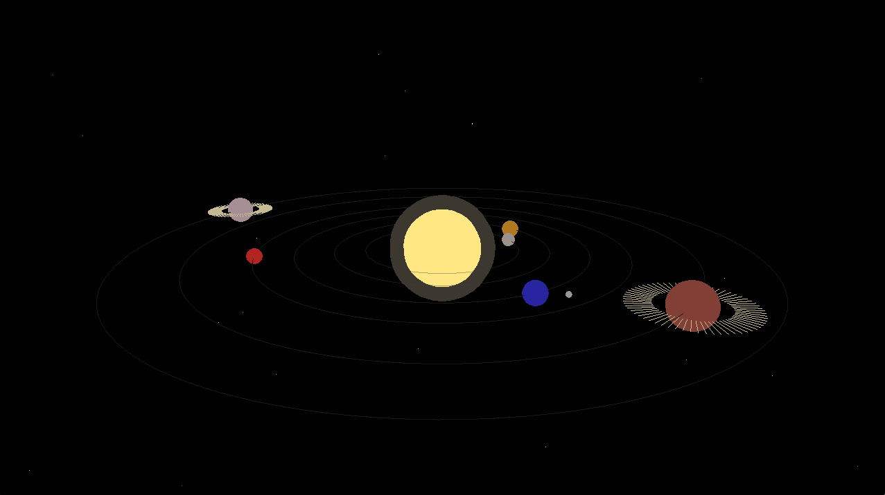
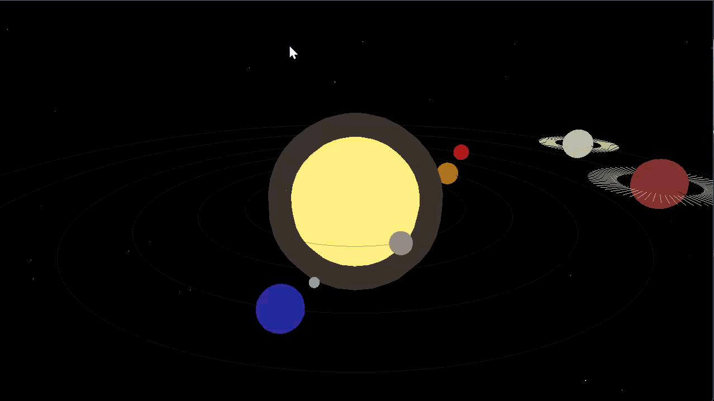

# GraficasAndSpace - Sistema Solar 3D - Proyecto 3

## Descripción

Sistema solar interactivo en 3D implementado en Rust usando Raylib. Los planetas son generados mediante shaders procedurales sin usar texturas ni materiales externos. El sistema incluye 6 planetas con órbitas realistas, rotación, traslación, anillos planetarios, luna orbital, skybox estrellado con 800 estrellas y efectos de warping animados en gigantes gaseosos.

## Características Implementadas

### Sistema Solar Completo
- **Sol**: Estrella central con halo luminoso y efecto de pulsación animado
- **6 Planetas** con órbitas y movimiento:
  - **Planetas Rocosos (4)**:
    - Mercurio
    - Venus
    - Tierra (con luna orbital)
    - Marte
  - **Gigantes Gaseosos (2)**:
    - Júpiter (con sistema de anillos y warping animado)
    - Saturno (con sistema de anillos y warping animado)

### Shaders Procedurales Avanzados
- **Planetas Rocosos**: Shader con 4 capas de color que simula superficie rocosa
- **Gigantes Gaseosos**: Shader con bandas atmosféricas animadas y turbulencias simuladas con efecto de warping
- **Warping Animado**: Los gigantes gaseosos muestran distorsión temporal en sus bandas atmosféricas mediante:
  - Ondas de distorsión independientes que distorsionan la geometría
  - Tormenta circular animada que se desplaza por la superficie
  - Turbulencias procedurales que evolucionan con el tiempo
- Iluminación Lambert y efectos especulares
- Rim lighting para efecto atmosférico

### Skybox Estrellado Procedural
- Campo de 800 estrellas generadas proceduralmente
- Distribución esférica uniforme usando funciones hash
- 3 tamaños de estrellas: pequeñas (80%), medianas (15%), grandes (5%)
- Brillo variable para cada estrella
- Efecto de profundidad espacial que sigue la cámara

### Sistema de Órbitas
- Cada planeta mantiene su propio radio orbital y velocidad
- Órbitas visualizadas con círculos semi-transparentes de 128 segmentos
- La luna orbita independientemente alrededor de la Tierra
- Velocidades orbitales proporcionales a la distancia del sol

### Cámara 3D Interactiva
- Rotación libre en todos los ejes 
- Sistema de zoom suave con límites, para mantener el sistema solar visible
- Control por teclado (WASD) y mouse drag
- Posicionamiento orbital alrededor del sistema

## Controles

| Tecla/Acción | Función |
|--------------|---------|
| **A** | Rotar cámara a la izquierda |
| **D** | Rotar cámara a la derecha |
| **W** | Acercar cámara (zoom in) |
| **S** | Alejar cámara (zoom out) |
| **R** | Activar/desactivar rotación y traslación de planetas |
| **G** | Mostrar/ocultar rejilla de referencia |
| **U** | Mostrar/ocultar interfaz de usuario |
| **Click Izquierdo + Arrastrar** | Rotar cámara libremente en cualquier dirección |

## Instalación y Ejecución

### Requisitos
- Rust 1.70 o superior
- Cargo

### Compilar y Ejecutar
```bash
# Clonar el repositorio y Compilar 

cargo build 

# Y por ultimo ejecutar el programa

cargo run
```

## Estructura del Proyecto

```
src/
├── main.rs          # Punto de entrada y loop principal del juego
├── camera.rs        # Sistema de cámara 3D con controles
├── planet.rs        # Definición de planetas y sus propiedades
├── renderer.rs      # Motor de renderizado de la escena y skybox
├── shaders.rs       # Shaders procedurales con warping animado
├── skybox.rs        # Sistema de generación y renderizado de estrellas
├── orbit.rs         # Sistema de órbitas y tiempo
└── utils.rs         # Utilidades matemáticas
```

## Dependencias

```toml
nalgebra = "0.34.1"  # Álgebra lineal para matemáticas 3D
rand = "0.9.2"       # Generación de números aleatorios
raylib = "5.5.1"     # Motor gráfico 3D
```

## Detalles Técnicos

### Sistema de Shaders Procedurales

Cada tipo de planeta utiliza un shader personalizado con múltiples capas:

#### Planetas Rocosos
1. **Capa Base**: Mezcla de tonalidades según latitud con variación temporal
2. **Capa de Ruido**: Hash noise para simular cráteres y terreno irregular
3. **Iluminación Difusa**: Modelo Lambert desde el sol como fuente de luz
4. **Efectos Especulares**: Reflejos en superficie rocosa y reflejos espaciales
5. **Rim Lighting**: Efecto atmosférico en los bordes con exponente cuadrático

#### Gigantes Gaseosos 
1. **Bandas Atmosféricas Base**: Patrones que simulan corrientes de gas
2. **Warping Multi-Onda**: 
   - Onda 1: Distorsión horizontal (frecuencia 3.0, velocidad 0.8)
   - Onda 2: Distorsión vertical (frecuencia 4.0, velocidad -0.5)
   - Onda 3: Distorsión latitudinal (frecuencia 2.0, velocidad 1.2)
3. **Tormenta Circular Animada**: Centro de tormenta que se desplaza con el tiempo
4. **Turbulencias Procedurales**: Variaciones con hash noise temporal
5. **Animación Temporal Continua**: Las bandas se mueven y distorsionan constantemente
6. **Iluminación Volumétrica**: Efectos de luz difusa en atmósfera densa
7. **Rim Lighting Atmosférico**: Halo pronunciado con exponente cúbico

### Skybox Procedural
- **Generación de Estrellas**: Usando distribución esférica uniforme
  - Ángulo theta: [0, 2π] para rotación ecuatorial
  - Ángulo phi: [0, π] para latitud esférica
  - Conversión a coordenadas cartesianas (x, y, z)
- **Sistema de Hash**: Función hash determinista basada en seno
- **Categorías de Estrellas**:
  - Pequeñas (radio 0.03): 80% de la población
  - Medianas (radio 0.05): 15% de la población
  - Grandes (radio 0.08): 5% de la población
- **Renderizado**: Esferas dibujadas a distancia fija de 100 unidades
- **Seguimiento de Cámara**: El skybox siempre mantiene su posición relativa

### Sistema de Renderizado
Pipeline de renderizado en orden:
1. **Skybox**: Fondo estrellado
2. **Rejilla de Referencia**: Grid opcional de 41x41 líneas
3. **Sol**: Estrella central con doble esfera (núcleo + halo) y pulsación
4. **Órbitas**: Círculos semi-transparentes para cada planeta
5. **Planetas**: Con shaders procedurales aplicados
6. **Anillos Planetarios**: Geometría de líneas 3D en 64 segmentos
7. **Luna**: Esfera pequeña orbitando la Tierra


## Video Demostrativo

<div align="center"> 
  <a href="https://uvggt-my.sharepoint.com/:v:/g/personal/dele23202_uvg_edu_gt/IQC8i63wzVNRSb-iZ34wV567Acf-PXu09O72bg0uZeNJ0i0?nav=eyJyZWZlcnJhbEluZm8iOnsicmVmZXJyYWxBcHAiOiJPbmVEcml2ZUZvckJ1c2luZXNzIiwicmVmZXJyYWxBcHBQbGF0Zm9ybSI6IldlYiIsInJlZmVycmFsTW9kZSI6InZpZXciLCJyZWZlcnJhbFZpZXciOiJNeUZpbGVzTGlua0NvcHkifX0&e=sAOQVG">  
  </a>
</div>

*Haz clic en la imagen para ver el video demostrativo del sistema solar en acción.*

## Screenshots


*Vista general del sistema solar con todos los planetas en órbita y skybox estrellado*


*Demostración del movimiento orbital del Sistema Solar*

## Autor

Paula De León

