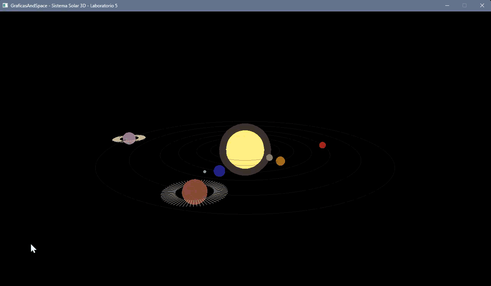

# GraficasAndSpace - Sistema Solar 3D - Laboratorio 5

## Descripción

Este Laboratorio implementa un sistema solar interactivo en 3D donde todo el sistema solar se visualiza en una escena 3D. Los planetas son generados mediante shaders procedurales sin usar texturas ni materiales externos. El sistema incluye 6 planetas con órbitas realistas, rotación, traslación, anillos planetarios y lunas.

## Características

### Sistema Solar
- **6 Planetas**: Mercurio, Venus, Tierra, Marte, Júpiter y Saturno
- **Sol**: Estrella central con halo luminoso
- **Planetas Rocosos** (4):
  - Mercurio
  - Venus
  - Tierra (con luna orbital)
  - Marte
- **Gigantes Gaseosos** (2):
  - Júpiter (con sistema de anillos)
  - Saturno (con sistema de anillos)

Cada tipo de planeta utiliza shaders procedurales complejos con múltiples capas

## Controles

| Tecla | Acción |
|-------|--------|
| **A** | Rotar cámara a la izquierda |
| **D** | Rotar cámara a la derecha |
| **W** | Acercar cámara (zoom in) |
| **S** | Alejar cámara (zoom out) |
| **R** | Activar/desactivar rotación de planetas |
| **G** | Mostrar/ocultar rejilla |
| **U** | Mostrar/ocultar interfaz de usuario |
| **Mouse Left Click + Drag** | Rotar cámara libremente |

## Instalación y Ejecución

### Requisitos
- Rust 1.70 o superior
- Cargo

### Pasos
```bash
# Clonar el repositorio y Compilar y ejecutar

cargo run --release
```

## Estructura del Proyecto en carpeta source code

```
src/
├── main.rs          # Punto de entrada y loop principal
├── camera.rs        # Sistema de cámara 3D
├── planet.rs        # Definición de planetas
├── renderer.rs      # Motor de renderizado
├── shaders.rs       # Shaders procedurales
├── orbit.rs         # Sistema de órbitas
└── utils.rs         # Utilidades matemáticas
```

## Dependencias

```toml
nalgebra = "0.34.1"  # Álgebra lineal
rand = "0.9.2"       # Generación aleatoria
raylib = "5.5.1"     # Motor gráfico
```

## Detalles Técnicos de Implementación

### Sistema de Capas de Color

Cada shader implementa una cantidad de 4 capas que afectan el color final:

1. **Capa Base**: Mezcla de tonalidades según posición
2. **Capa de Detalle**: Detalles entre los planetas
3. **Capa de Iluminación**: iluminacion y sombras
4. **Capa Atmosférica**: efecto atmosférico

### Renderizado de Anillos
Los anillos planetarios se implementan como geometría separada utilizando líneas 3D que forman un disco alrededor de cada planeta.

### Sistema Orbital
- Cada planeta mantiene su propio radio orbital y velocidad
- Las órbitas se visualizan con círculos semi-transparentes
- Las luna orbita independientemente alrededor de su planeta

## Screenshots




## Autor

Paula De León

---
